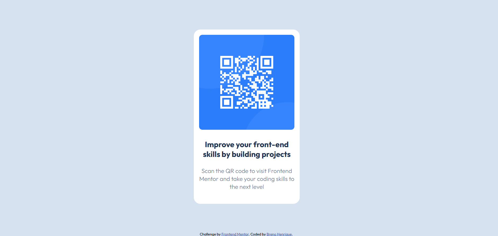

# Frontend Mentor - QR code component solution

Esta é uma solução para o desafio [QR code component do Frontend Mentor](https://www.frontendmentor.io/challenges/qr-code-component-iux_sIO_H). Os desafios do Frontend Mentor ajuda a melhorar nossas habilidades construindo projetos reais

## Tabela de Conteúdo

- [Visão Geral](#visão-geral)
  - [Screenshot](#screenshot)
- [O processo](#o-processo)
  - [Feito com](#feito-com)
  - [O que aprendi](#o-que-aprendi)
- [Autor](#autor)


## Visão Geral

### Screenshot



## O processo

### Feito com

- Tags Semânticas do HTML5
- Propriedades do CSS
- Flexbox

### O que aprendi

Através desse projeto pude aprender e entender melhor as tags semanticas do HTML e também a estilizar os elemntos através do CSS bem como posicionar os elementos na tela utilizando o Flexbox

```html
<section class="conteudo-principal">
      <div class="div-image">
        
      </div>
      
      <h3>Improve your front-end skills by building projects</h3>
      <p>Scan the QR code to visit Frontend Mentor and take your coding skills to the next level</p>
</section>
```
```css
:root{
    --fundo-branco: hsl(0, 0%, 100%);
    --fundo-azul-claro: hsl(212, 45%, 89%);
    --fundo-azul: hsl(216, 15%, 48%);
    --fundo-azul-escuro: hsl(218, 44%, 22%);
}
```
```css
.conteudo-principal{
    background-color: var(--fundo-branco);
    max-width: 32rem;
    padding: 1.6rem 1.6rem 4rem 1.6rem;
    border-radius: 2rem;
    display: flex;
    flex-flow: column;
    gap: 2.4rem;
    text-align: center;
    
}
```

## Autor

- Linkedin - [Breno Henrique](https://www.linkedin.com/in/breno-henrique-matos-17054219b/)
- GitHub - [Breno Matos](https://github.com/Breno-Matos)
- Frontend Mentor - [@Breno-Matos](https://www.frontendmentor.io/profile/Breno-Matos)


